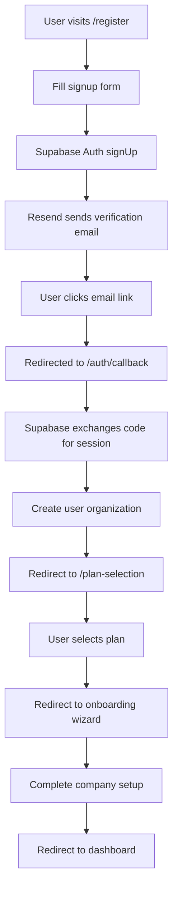

# PayMatch Onboarding & Plan Flow

## Overview

This document outlines the complete user onboarding experience from signup to first invoice, with plan-specific customization and a guided dashboard checklist.

---

## 1. Signup & Verification

### User Journey

- User signs up with email + password using Supabase Auth
- System creates organization automatically (default plan = free)
- User receives verification email via Resend
- After verifying → redirected to Plan Selection

### Technical Implementation

```typescript
// Signup flow using Supabase Auth
import { createClient } from '@/lib/supabase/client'

const supabase = createClient()

// User signup
const { data, error } = await supabase.auth.signUp({
  email: 'user@example.com',
  password: 'secure_password',
  options: {
    data: {
      name: 'John Doe'
    }
  }
})

// Response
{
  "user": {
    "id": "uuid",
    "email": "user@example.com",
    "email_confirmed_at": null,
    "user_metadata": {
      "name": "John Doe"
    }
  },
  "session": null, // Will be set after email verification
  "organization": {
    "id": "uuid",
    "name": "John Doe's Organization",
    "plan": "free"
  }
}
```

### Email Verification Flow

```typescript
// Email verification using Resend
// Supabase automatically sends verification email via Resend
// User clicks link in email → redirected to /auth/callback

// Callback handler
export async function GET(request: Request) {
  const { searchParams, origin } = new URL(request.url);
  const code = searchParams.get('code');
  const next = searchParams.get('next') ?? '/dashboard';

  if (code) {
    const supabase = createClient();
    const { error } = await supabase.auth.exchangeCodeForSession(code);

    if (!error) {
      // Create organization for user
      await createUserOrganization();

      // Redirect to plan selection
      return NextResponse.redirect(`${origin}/plan-selection`);
    }
  }

  // Error redirect
  return NextResponse.redirect(`${origin}/auth/auth-code-error`);
}
```

### Password Reset Flow

```typescript
// Password reset using Supabase Auth + Resend
import { createClient } from '@/lib/supabase/client';

const supabase = createClient();

// Request password reset
const { error } = await supabase.auth.resetPasswordForEmail(
  'user@example.com',
  {
    redirectTo: `${origin}/auth/reset-password`,
  }
);

// Password reset handler
export async function POST(request: Request) {
  const { email } = await request.json();

  const supabase = createClient();
  const { error } = await supabase.auth.resetPasswordForEmail(email, {
    redirectTo: `${origin}/auth/reset-password`,
  });

  if (error) {
    return NextResponse.json({ error: error.message }, { status: 400 });
  }

  return NextResponse.json({
    message: 'Password reset email sent',
  });
}

// Update password after reset
const { error } = await supabase.auth.updateUser({
  password: 'new_password',
});
```

---

## 2. Plan Selection (Post-Verification)

### Plan Options Display

- **Free Plan (CHF 0/month)**
  - 5 invoices/month, 3 clients
  - Full feature access
  - No team features

- **Freelancer Plan (CHF 5/month)**
  - Unlimited invoices and clients
  - Single user
  - All core features

- **Business Plan (CHF 50/month)**
  - Unlimited invoices and clients
  - Up to 3 users
  - Team management features

- **Enterprise Plan (CHF 150/month)**
  - Unlimited everything
  - Dedicated support

### Plan Selection Flow

```typescript
// Plan selection
POST /api/orgs/:orgId/select-plan
{
  "plan": "freelancer",
  "billing_cycle": "monthly" // or "annual"
}

// For paid plans
POST /api/stripe/create-subscription
{
  "plan_id": "price_freelancer_monthly",
  "org_id": "uuid"
}
```

### Post-Selection Actions

- **Free Plan:** Immediate access to onboarding wizard
- **Paid Plans:** Stripe checkout → subscription activated → onboarding wizard

---

## 3. Onboarding Wizard (Critical Setup Only)

### Step 1 — Organization / Company Details

**Required Fields:**

- Organization / Company name
- Address (street, ZIP, city, canton, country)
- IBAN or QR-IBAN
- VAT number (optional, recommended)

**Validation:**

- IBAN format validation
- Swiss address format compliance
- VAT number format (if provided)

**UI Behavior:**

- Clear error messages for invalid formats
- Help text for Swiss compliance requirements
- Progress indicator (Step 1 of 3)

```typescript
// Organization setup
PATCH /api/orgs/:orgId
{
  "name": "Alpine Studio GmbH",
  "legal_name": "Alpine Studio GmbH",
  "street": "Musterstrasse 123",
  "zip": "8001",
  "city": "Zürich",
  "canton": "ZH",
  "country": "CH",
  "iban": "CH93 0076 2011 6238 5295 7",
  "vat_number": "CHE-123.456.789"
}
```

### Step 2 — Default Settings

**Configuration Options:**

- Invoice language (DE / FR / IT / EN, auto from browser)
- Default currency (CHF pre-selected)
- Default payment terms (30 days default)

**UI Behavior:**

- Language auto-detection with manual override
- Currency locked to CHF for Swiss market
- Payment terms with common presets (14, 30, 60 days)

```typescript
// Default settings
PATCH /api/orgs/:orgId/settings
{
  "default_language": "de",
  "default_currency": "CHF",
  "default_payment_terms_days": 30
}
```

### Step 3 — 🎉 Success Screen

**Success Message:**
"Great! Your company profile is set up — you're ready to send your first invoice."

**Call-to-Action:**

- Primary: "Go to Dashboard"
- Secondary: "View Company Settings"

**Teaser Text:**
"Next steps: Add logo, clients, and reminders."

---

## 4. Dashboard Checklist (Guided Completion)

### Checklist Items by Plan

**All Plans:**

- ✅ Upload your logo
- ✅ Add your first client
- ✅ Create and send your first invoice
- ✅ Set up payment reminders

**Business Plan Only:**

- ✅ Invite team members

### Checklist Implementation

```typescript
// Checklist progress tracking
interface ChecklistItem {
  id: string;
  title: string;
  description: string;
  completed: boolean;
  plan_required?: string[];
  action_url: string;
}

const checklistItems: ChecklistItem[] = [
  {
    id: 'upload_logo',
    title: 'Upload your logo',
    description: 'Add your company logo to invoices',
    completed: false,
    action_url: '/settings/company',
  },
  {
    id: 'add_client',
    title: 'Add your first client',
    description: 'Create a client profile',
    completed: false,
    action_url: '/clients/new',
  },
  {
    id: 'create_invoice',
    title: 'Create and send your first invoice',
    description: 'Generate your first QR-bill invoice',
    completed: false,
    action_url: '/invoices/new',
  },
  {
    id: 'setup_reminders',
    title: 'Set up payment reminders',
    description: 'Configure automatic payment reminders',
    completed: false,
    action_url: '/settings/reminders',
  },
  {
    id: 'invite_team',
    title: 'Invite team members',
    description: 'Add team members to collaborate',
    completed: false,
    plan_required: ['business', 'enterprise'],
    action_url: '/settings/team',
  },
];
```

### Progress Tracking

**Progress Bar:**

- Visual progress indicator (0% → 100%)
- Micro-celebrations (confetti/checkmarks)
- Auto-minimizes once 100% complete

**Completion Rewards:**

- Step completion animations
- Progress milestone celebrations
- Achievement badges

---

## 5. Plan-Specific Onboarding Variations

### Free Plan Onboarding

- **Focus:** Core invoicing features
- **Checklist:** Basic setup items only
- **Upsell:** Subtle prompts to upgrade for unlimited volume

### Freelancer Plan Onboarding

- **Focus:** Unlimited volume, single-user efficiency
- **Checklist:** Standard setup items
- **Upsell:** Team collaboration features

### Business Plan Onboarding

- **Focus:** Team collaboration and advanced features
- **Checklist:** Includes team invitation
- **Upsell:** Enterprise features and custom integrations

### Enterprise Plan Onboarding

- **Focus:** Advanced features and dedicated support
- **Checklist:** Full feature access
- **Support:** Dedicated onboarding specialist

---

## 6. Technical Implementation

### Supabase Auth Configuration

```typescript
// src/lib/supabase/client.ts
import { createBrowserClient } from '@supabase/ssr';

export function createClient() {
  return createBrowserClient(
    process.env.NEXT_PUBLIC_SUPABASE_URL!,
    process.env.NEXT_PUBLIC_SUPABASE_ANON_KEY!
  );
}

// src/lib/supabase/server.ts
import { createServerClient } from '@supabase/ssr';
import { cookies } from 'next/headers';

export function createClient() {
  const cookieStore = cookies();

  return createServerClient(
    process.env.NEXT_PUBLIC_SUPABASE_URL!,
    process.env.NEXT_PUBLIC_SUPABASE_ANON_KEY!,
    {
      cookies: {
        getAll() {
          return cookieStore.getAll();
        },
        setAll(cookiesToSet) {
          try {
            cookiesToSet.forEach(({ name, value, options }) =>
              cookieStore.set(name, value, options)
            );
          } catch {
            // The `setAll` method was called from a Server Component.
            // This can be ignored if you have middleware refreshing
            // user sessions.
          }
        },
      },
    }
  );
}
```

### Resend Email Configuration

```typescript
// src/lib/resend.ts
import { Resend } from 'resend';

export const resend = new Resend(process.env.RESEND_API_KEY);

// Email templates
export const emailTemplates = {
  verification: {
    subject: 'Verify your PayMatch account',
    from: 'PayMatch <noreply@paymatch.ch>',
  },
  passwordReset: {
    subject: 'Reset your PayMatch password',
    from: 'PayMatch <noreply@paymatch.ch>',
  },
  welcome: {
    subject: 'Welcome to PayMatch!',
    from: 'PayMatch <noreply@paymatch.ch>',
  },
};
```

### Database Schema Updates

```sql
-- Add onboarding tracking
ALTER TABLE organizations ADD COLUMN onboarding_completed BOOLEAN DEFAULT false;
ALTER TABLE organizations ADD COLUMN onboarding_step INTEGER DEFAULT 1;

-- Checklist progress tracking
CREATE TABLE user_checklist_progress (
  id UUID PRIMARY KEY DEFAULT gen_random_uuid(),
  user_id UUID REFERENCES auth.users(id) ON DELETE CASCADE,
  org_id UUID REFERENCES organizations(id) ON DELETE CASCADE,
  checklist_item_id TEXT NOT NULL,
  completed_at TIMESTAMPTZ,
  created_at TIMESTAMPTZ DEFAULT now()
);

-- User profiles (extends auth.users)
CREATE TABLE user_profiles (
  id UUID PRIMARY KEY REFERENCES auth.users(id) ON DELETE CASCADE,
  name TEXT,
  avatar_url TEXT,
  created_at TIMESTAMPTZ DEFAULT now(),
  updated_at TIMESTAMPTZ DEFAULT now()
);
```

### API Endpoints

```typescript
// Get onboarding progress
GET /api/orgs/:orgId/onboarding/progress

// Update checklist item
POST /api/orgs/:orgId/checklist/:itemId/complete

// Get checklist items for plan
GET /api/plans/:planId/checklist-items

// Auth endpoints (handled by Supabase Auth)
POST /auth/signup
POST /auth/signin
POST /auth/signout
POST /auth/reset-password
GET /auth/callback
```

### Edge Functions for Auth

```typescript
// supabase/functions/send-verification-email/index.ts
import { serve } from 'https://deno.land/std@0.168.0/http/server.ts';
import { createClient } from 'https://esm.sh/@supabase/supabase-js@2';
import { Resend } from 'https://esm.sh/resend@2.0.0';

const resend = new Resend(Deno.env.get('RESEND_API_KEY'));

serve(async (req) => {
  const { email, token } = await req.json();

  // Send verification email via Resend
  const { data, error } = await resend.emails.send({
    from: 'PayMatch <noreply@paymatch.ch>',
    to: [email],
    subject: 'Verify your PayMatch account',
    html: `
      <h1>Welcome to PayMatch!</h1>
      <p>Please verify your email address by clicking the link below:</p>
      <a href="${Deno.env.get('SUPABASE_URL')}/auth/v1/verify?token=${token}">
        Verify Email
      </a>
    `,
  });

  return new Response(JSON.stringify({ success: !error }));
});
```

### Authentication Flow Summary



### Key Benefits of Supabase Auth + Resend

- **No OTP complexity**: Direct email verification links
- **Swiss compliance**: Resend handles Swiss email regulations
- **Reliable delivery**: Resend's high deliverability rates
- **Branded emails**: Custom email templates with PayMatch branding
- **Security**: Supabase handles all auth security concerns
- **Scalability**: Built-in rate limiting and abuse prevention

---

## 7. Why This Flow Works

### Separation of Concerns

- **Signup → Verify → Plan → Onboarding**
- Clear progression with no dead ends
- Each step has a specific purpose

### Plan-First Approach

- User commits to Free vs Paid before entering product
- Reduces decision fatigue during onboarding
- Clear value proposition upfront

### Compliance Upfront

- Wizard ensures QR-bill–ready from day 1
- Swiss market requirements met immediately
- Legal compliance built into flow

### Flexible Checklist

- Adapts to plan (extra "Invite members" for Business)
- Gamified completion encourages full setup
- Non-blocking progress tracking

### Motivation Loop

- Visual progress indicators
- Achievement celebrations
- Clear next steps

---

## 8. Optional Enhancements

### Demo Mode for Free Plan

- Generate fake client & invoice
- Show QR-bill instantly
- Demonstrate full platform value

### Business Plan Team Nudge

- End wizard with "Next: Invite your team" prompt
- Keep invite in checklist for non-blocking flow
- Team invitation tutorial

### Onboarding Analytics

- Track completion rates by plan
- Identify drop-off points
- A/B test different flows

---

## 9. Success Metrics

### Authentication Success

- **Email Verification Rate:** 85% verify within 24 hours
- **Password Reset Success:** 90% successful resets
- **Auth Error Rate:** < 2% authentication failures
- **Email Delivery Rate:** 99%+ via Resend

### Onboarding Completion

- **Target:** 80% complete onboarding wizard
- **Target:** 60% complete dashboard checklist
- **Target:** 40% create first invoice within 24 hours

### Plan Conversion

- **Free → Freelancer:** 15% within 30 days
- **Freelancer → Business:** 10% within 90 days
- **Business → Enterprise:** 5% within 180 days

### User Engagement

- **Time to First Invoice:** < 30 minutes
- **Checklist Completion:** < 7 days
- **Feature Adoption:** 70% use core features
- **Session Duration:** 5+ minutes average

---

This onboarding flow ensures every user gets a consistent, compliant, and engaging experience while respecting plan-specific features and limitations.
