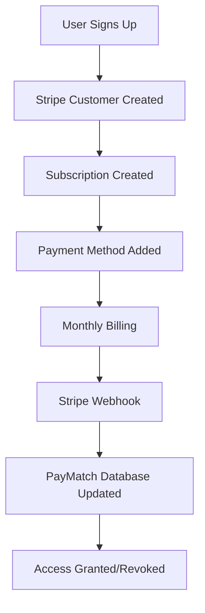
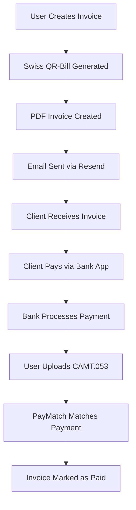

# PayMatch Payment Architecture

## Overview

PayMatch uses a **dual payment architecture** that separates subscription billing from invoice payments, optimized for the Swiss market and Swiss banking culture.

## Architecture Components

### 1. Subscription Billing (Stripe)

**Purpose**: Manage PayMatch subscription plans only

- Freelancer Plan: CHF 5/month
- Business Plan: CHF 50/month
- Enterprise Plan: CHF 150/month

**Stripe Products Used**:

- Stripe Billing
- Stripe Customers
- Stripe Subscriptions
- Stripe Customer Portal
- Stripe Webhooks

**What Stripe Does NOT Handle**:

- Invoice payments
- Invoice creation
- Swiss QR-bill generation
- Bank reconciliation

### 2. Invoice Payments (Swiss QR-Bill)

**Purpose**: Handle actual business invoice payments

- Swiss QR-bill compliant invoices
- Direct bank transfers
- CAMT.053 bank reconciliation

**Components**:

- Swiss QR-bill library (`swissqrbill`)
- PDF generation (PDFKit)
- Email delivery (Resend)
- Bank statement import (CAMT.053)

## Detailed Payment Flows

### Subscription Billing Flow



**Implementation**:

```typescript
// Create Stripe customer
const customer = await stripe.customers.create({
  email: user.email,
  name: user.name,
  metadata: { paymatch_user_id: user.id },
});

// Create subscription
const subscription = await stripe.subscriptions.create({
  customer: customer.id,
  items: [{ price: 'price_freelancer_monthly' }],
  currency: 'chf',
  payment_behavior: 'default_incomplete',
  expand: ['latest_invoice.payment_intent'],
});
```

### Invoice Payment Flow



**Implementation**:

```typescript
// Generate Swiss QR-bill
const qrBillData = {
  amount: invoiceAmount,
  currency: 'CHF',
  creditor: companyData,
  debtor: clientData,
  reference: generateQRReference(invoiceId),
};

const qrBill = new SwissQRBill(qrBillData);
const pdf = new PDFDocument();
qrBill.attachTo(pdf);

// Send via Resend
await resend.emails.send({
  from: 'invoices@paymatch.ch',
  to: client.email,
  subject: `Invoice #${invoiceNumber}`,
  attachments: [{ filename: 'invoice.pdf', content: pdfBuffer }],
});
```

## Technical Implementation

### Stripe Integration (Subscriptions Only)

**Environment Variables**:

```bash
# Stripe (Subscription billing only)
STRIPE_SECRET_KEY=sk_test_...
NEXT_PUBLIC_STRIPE_PUBLISHABLE_KEY=pk_test_...
STRIPE_WEBHOOK_SECRET=whsec_...
```

**Key Features**:

- Customer management
- Subscription lifecycle
- Payment method management
- Billing portal access
- Webhook handling

### Swiss QR-Bill Integration

**Dependencies**:

```json
{
  "swissqrbill": "^4.2.0",
  "pdfkit": "^0.14.0"
}
```

**Key Features**:

- QR-bill generation
- PDF invoice creation
- Multi-language support (DE, FR, IT, EN)
- Swiss compliance validation

### Bank Reconciliation

**CAMT.053 Import**:

- Parse ISO 20022 CAMT.053 files
- Match payments to invoices
- Update invoice status
- Generate reconciliation reports

## Benefits of This Architecture

### 1. Swiss Market Optimization

- **Familiar UX**: Swiss customers use QR-bills daily
- **Bank Integration**: Direct connection to Swiss banking
- **Compliance**: Full Swiss QR-bill compliance
- **Cost Effective**: No payment processing fees on invoices

### 2. Technical Benefits

- **Separation of Concerns**: Clear boundaries between billing and payments
- **Simpler Integration**: No complex payment processing
- **Better Performance**: Faster invoice generation
- **Easier Maintenance**: Less complex codebase

### 3. Business Benefits

- **Lower Costs**: No Stripe fees on invoice payments
- **Better Cash Flow**: Direct bank transfers
- **Swiss Compliance**: Meets all regulatory requirements
- **Customer Trust**: Familiar payment method

## Security Considerations

### Stripe Security

- Server-side only secret key usage
- Webhook signature verification
- PCI compliance for payment methods
- Secure customer data handling

### Swiss QR-Bill Security

- Reference number validation
- IBAN format verification
- Amount validation
- Currency compliance

### Bank Reconciliation Security

- File format validation
- Amount matching verification
- Reference number validation
- Audit trail maintenance

## Monitoring and Analytics

### Stripe Metrics

- Subscription conversion rates
- Churn analysis
- Revenue tracking
- Payment method success rates

### Invoice Metrics

- Invoice generation time
- Email delivery rates
- Payment reconciliation accuracy
- Customer payment behavior

## Error Handling

### Stripe Errors

- Subscription creation failures
- Payment method issues
- Webhook processing errors
- Customer portal access problems

### Invoice Errors

- QR-bill generation failures
- PDF creation errors
- Email delivery failures
- Bank reconciliation mismatches

## Future Enhancements

### Phase 1 (Current)

- Manual CAMT.053 upload
- Basic reconciliation matching
- Swiss QR-bill compliance

### Phase 2 (Future)

- Automated bank API integration
- Real-time payment notifications
- Advanced reconciliation algorithms
- Multi-bank support

### Phase 3 (Advanced)

- AI-powered payment matching
- Predictive cash flow analysis
- Advanced reporting and analytics
- International expansion support

## Compliance and Regulations

### Swiss Requirements

- QR-bill format compliance
- Swiss VAT calculations
- Multi-language support
- Data protection (GDPR)

### Banking Standards

- ISO 20022 CAMT.053 support
- Swiss banking integration
- Reference number standards
- Currency handling (CHF/EUR)

This architecture provides a robust, Swiss-optimized payment system that separates subscription billing from invoice payments while maintaining compliance and user experience excellence.
